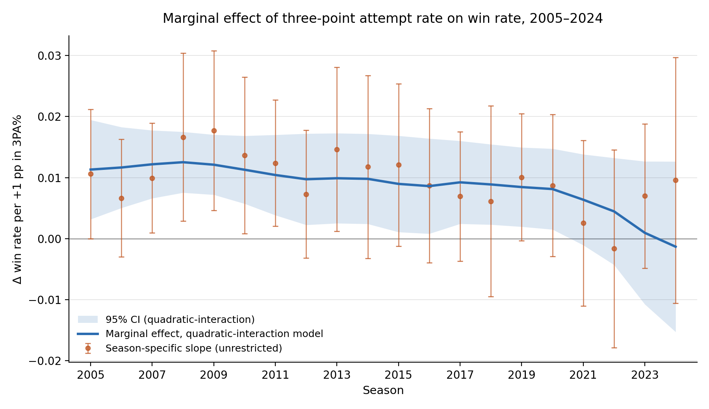

# Three-Point Attempt Rate and Winning Outcomes: Evidence from the NBA (2005–2024)

Does shooting more three-pointers win NBA games, and has that return changed as the whole league embraced the three? This repository contains the [paper](haotian_nba-three-point-returns-project.pdf), data, and Stata code for a panel study of 600 team-seasons from 2005 to 2024.

The project began as a group project for Autumn 2025 ECON 4831: Sports Data Analytics and Economic Analysis at The Ohio State University. This version rebuilds the analysis and reaches a different conclusion. The original version of the project is in [`history/`](history/).

---

## Changes from the original version

**Dropped two bad controls.** The original model controlled for offensive and defensive ratings. Yet both turned out to be bad controls: they are outcomes of the same season's play and sit between shot selection and winning, so holding them fixed blocks the very pathway through which three-point shooting affects winning. Once I removed the controls, the return to three-point volume went from roughly zero to large and highly significant.

**Fixed the team identifiers.** Teams that were renamed or relocated (SuperSonics/Thunder, Nets, Bobcats/Hornets, Hornets/Pelicans) are merged, resulting in 30 franchises observed in all 20 seasons.

**Estimated the time-varying model.** The original paper stated a model in which the effect of three-point attempt rate changes over time, but never estimated it in a single regression. The new version estimates it in full and computes the marginal effect for every season and clusters standard errors by franchise.

---

## Findings



- Each percentage point increase in a team's three-point attempt rate is associated with a **0.97 percentage point increase in win rate**, or about 0.8 more wins per season (p < 0.001).
- The return was largest in the mid-2000s and appears to erode as the rest of the league shoots more threes. The decline is not statistically significant (F = 1.62, p = 0.215), so this is suggestive rather than established.
- There is no period of rising returns. The advantage of increasing three-point shooting was already there in 2005, long before most teams acted on it.

| Specification | Coefficient on 3PA% | Std. error |
|---|---|---|
| No fixed effects | 0.249 | (0.103) |
| **Team and season fixed effects** | **0.968** | **(0.237)** |
| + the original model's controls (ORtg, DRtg, Pace) | −0.061 | (0.060) |

Standard errors clustered by franchise. Net rating alone explains 93.5% of the variance in win rate, which is why adding offensive and defensive ratings leaves almost nothing for shot selection to explain.

---

## Files

| File | Description |
|---|---|
| `haotian_nba-three-point-returns-project.pdf` | Paper |
| `nba_advanced_stats.csv` | Panel data, 600 team-seasons |
| `nba_3pa_analysis_regression.do` | Replication code for Tables 2–4, the hypothesis tests, the robustness checks, and Figure 1 |
| `figure1_marginal_effect_stata.png` | Figure 1 |
| `history/` | The original group project |

## Reproducing the results

Tested in Stata 17. The only user-written package needed is `estout`:

```stata
ssc install estout
```

Set the working directory to the repository folder and run:

```stata
do nba_3pa_analysis_regression.do
```

The file uses only basic commands (`reg`, `test`, `lincom`, `eststo`, `esttab`, `estpost`). It estimates the fixed-effects models by demeaning each variable within franchise before calling `reg`, which gives exactly the same coefficients and standard errors as dedicated fixed-effects commands such as `reghdfe`. The file ends with a block that prints its key results next to the values reported in the paper.

## Data

Team-level regular-season statistics from [Basketball-Reference](https://www.basketball-reference.com/), cleaned and posted here for replication only.

| Column | Description |
|---|---|
| `Team` | Team name as recorded (35 values) |
| `Franchise`, `FranchiseID` | Consolidated franchise (30 values) |
| `Season`, `YearIndex` | Season, labeled by the year it ends; counter from 1 (2005) to 20 (2024) |
| `WinRate` | Games won divided by games played |
| `3PA%` | Three-point attempts divided by field-goal attempts |
| `ORtg`, `DRtg` | Points scored and allowed per 100 possessions |
| `Pace` | Possessions per 48 minutes |

---

## Use of AI tools

I used Claude to 1) identify the inconsistency between 30 franchises and 35 teams, 2) replicate the Stata code of the regression results using reg, lincom, eststo, esttab, and estpost commands, 3) generate the figure of marginal effect with confidence intervals and slopes embedded, and 4) draft the Results and Conclusion sections of the paper and this README file.

## Author

Haotian Chang, MA student in Computational Social Science (Economics), University of Chicago.
